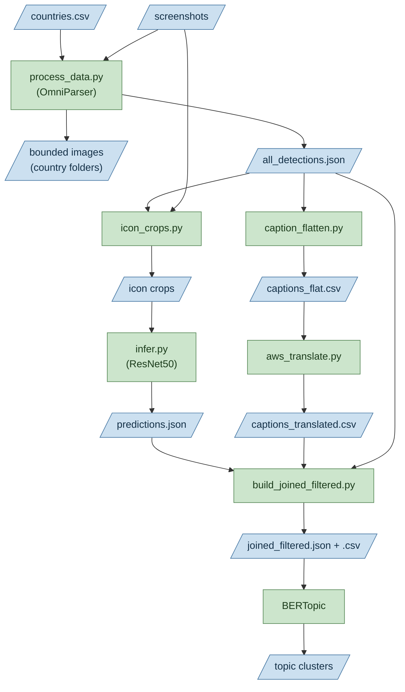

# Icon Detection and Clustering Model
---- Add in Blurb ----
## FLOWCHART OF DATA + FILES

### Omniparser
We ran Microsoft OmniParser v2 (YOLO detector + finetuned Florence-2 captioner) on each screenshot. Omniparser is a vision language model that produces per-image bounding boxes, semantic captions, and annotated images. See omniparser/README.md for setup, weights download, and the flash_attn / OCR-import patches required.

### RESNET50

We cropped each detected icon region from the source screenshots (icon_crops.py) and classifies them with a finetuned ResNet50 (infer.py). This produces per-icon class predictions.

### BERTOPIC

We used the classifications form Resnet50 and the captiosn from Omniparser as test input into BERTopic to produce Topic clusters for icons.
