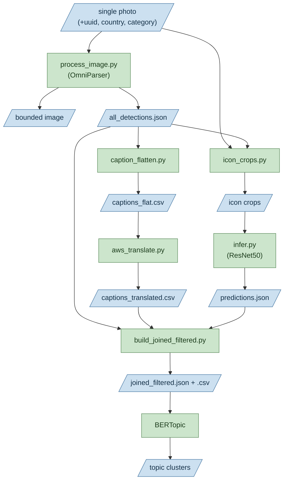

# Icon Detection and Clustering Model
---- Add in Blurb ----
## FLOWCHART OF DATA + FILES



### Omniparser
We ran Microsoft OmniParser v2 (YOLO detector + finetuned Florence-2 captioner) on each screenshot. Omniparser is a vision language model that produces per-image bounding boxes, semantic captions, and annotated images. See `omniparser/README.md` for setup, weights download, and the flash_attn / OCR-import patches required.

### RESNET50

We cropped each detected icon region from the source screenshots (`icon_crops.py`) and classifies them with a finetuned ResNet50 (`infer.py`). This produces per-icon class predictions.

### BERTOPIC

We used the classifications form Resnet50 and the captiosn from Omniparser as test input into BERTopic to produce Topic clusters for icons.

## Running the pipeline

`run_pipeline.py` runs the whole flow for a **single photo** (photo → topics). Everything is configured in `pipeline_config.json`.

1. Each stage runs in its own conda env. Create them once by following `ENVIRONMENTS.md`.
2. Edit `pipeline_config.json`: fill in the `python` path for each env (under `environments`), the `single_image` block (see below), and your output folder. Model paths under `Models/` are already set. More details in `ENVIRONMENTS.md`.
3. Run it:
   ```bash
   python run_pipeline.py
   ```

Each stage has an on/off switch under `stages` in the config. Turn a stage off to skip it and reuse existing output. For example, you can set `omniparser` and `translate` to `false` if you already have `all_detections.json` and `captions_translated.csv`.

### Input: a single photo

Fill in the `single_image` block in `pipeline_config.json` with the photo path plus its metadata:

```json
"single_image": {
  "image": "/path/to/shot.png",
  "uuid": "abc123",
  "country": "ar",
  "category": "Business and Finance"
}
```

`uuid` is the join key / crop-filename prefix; `country` and `category` are tags that ride into the outputs. The OmniParser stage script (`omniparser/process_image.py`) can also be run directly:

```bash
python omniparser/process_image.py --image shot.png \
  --uuid abc123 --country ar --category "Business and Finance" \
  --output-dir OUT --yolo-weights .../model.pt --florence-weights .../icon_caption_florence
```

### Calling it from your own Python code

`run_pipeline.py` has a `run_pipeline(...)` function, so another program can run the whole pipeline for one image and get the result back. It runs each stage as a subprocess in that stage's conda env. To run it, you need to setup the envs, OmniParser repo/weights, and a filled-in `pipeline_config.json` on the machine first (see setup above and `ENVIRONMENTS.md`).

```python
import sys
sys.path.insert(0, "/path/to/infographic_model")   # so the import resolves
from run_pipeline import run_pipeline

out = run_pipeline(
    image="/data/shot.png",
    uuid="abc123",
    country="ar",
    category="Business and Finance",
    omniparser_cwd="/path/to/OmniParser",   # lets stage 1 find util.utils
    work_dir="/tmp/run_abc123",
    stages={"translate": False},            # use this to skip any stage, like translate if no AWS acess
)

# returns a dict of output paths; the per-uuid topic-count vector is the end goal:
print(out["embeddings_og"])
```

Arguments override the `single_image` config values per call, so you don't edit the config each time. `python run_pipeline.py` still runs from the config as before.
